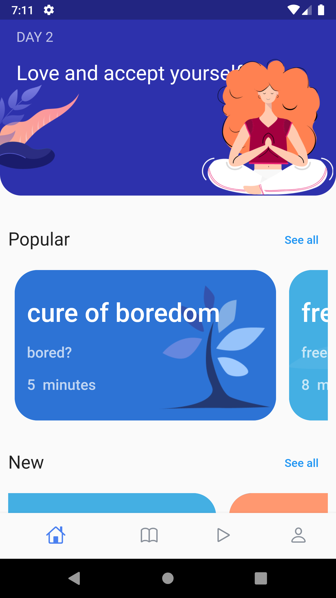
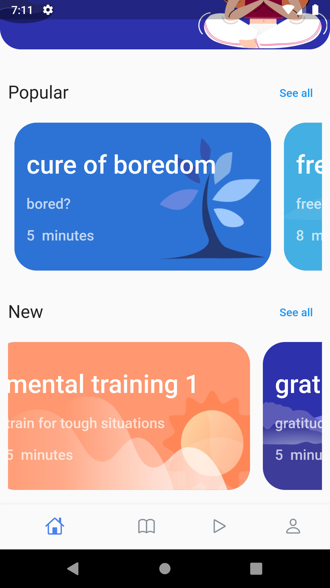

# meditation UI

A Flutter App inspired from [UI Giants](https://www.uplabs.com/posts/meditation-ios-app).

### 🔥&ensp; Preview
|              Home Screen             | 
| :----------------------------------: |
|</a> |
| :----------------------------------: |
|              Home Screen             |
|</a> |
| :----------------------------------: |
|              Practices Screen             |
|</a> |
| :----------------------------------: |
|              ProfileScreen Screen    |         |
|</a> |
| :----------------------------------: |
|              Player Screen           |
|</a> |
| :----------------------------------: |

### ⚡&ensp;Social Media

&ensp;Twitter: [@Whokrunal](hhttps://twitter.com/Whokrunal "Twitter Krunal Chuahan")

&ensp;Instagram: [@Krunal Chuahan](https://instagram.com/kruuunaaal "Instagram Krunal Chuahan")

&ensp;LinkedIn: [@Krunal Chauhan](https://www.linkedin.com/in/krunalchauhan/ "LinkedIn Krunal Chauhan")

&ensp;GitHub: [@Whokrunalchauhan](https://github.com/Whokrunalchauhan "GitHub Krunal Chauhan")

For help getting started with Flutter, view Flutter's
[online documentation](https://flutter.dev/docs), which offers tutorials,
samples, guidance on mobile development, and a full API reference.
